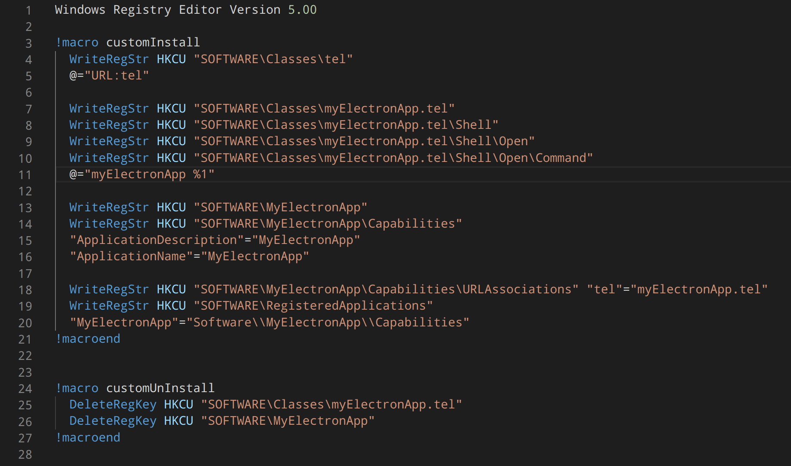

Recently I've been working on an [Electron](https://electronjs.org/) application.
While most of the programming when working with Electron is usually in Javascript or Typescript, there occasionally arises the need to venture off the beaten path to write some OS-level script or native C++ module - something which is completely foreign to a front end developer like myself. In the case of registering the app as a [protocol handler](https://developer.mozilla.org/en-US/docs/Web/API/Navigator/registerProtocolHandler/Web-based_protocol_handlers), that meant writing entries to the Windows Registry. 

**Caution: accomplishing this involves low-level scripting and could minorly screw up your machine if you aren't careful.**

### The Goal

For this use case, the goal is fairly simple: when a user encounters a protocol link somewhere on the web (the `tel:` protocol to be specific), we want our Electron app to be a registered handler for this protocol so that clicking the link will trigger the app to launch and pass through the link's embedded arguments (in this case, a phone number).

### Initial config

For users on Windows 7-10, you have a few options. Luckily the [electron-builder](https://www.electron.build/) packager provides some great utilities for the full distribution setup of your Electron app. One provided option is to configure electron-builder to run a `custom NSIS install script` - this is trivial to setup, just follow electron-builder's [custom NSIS script docs](https://nsis.sourceforge.io/Docs/).

In this NSIS script you'll be writing keys to the Windows registry. But first, a general [NSIS syntax](https://nsis.sourceforge.io/Docs/Chapter4.html#registry) overview. Here's what we'll be using:
- [Macros](https://nsis.sourceforge.io/Docs/Chapter5.html#macro) - separate our `installer.nsh` script into macro blocks which are run independently of each other - `!macro customInstall` and `!macro customUnInstall`. There are other macros available if you wish to dabble further.
- [WriteRegStr](https://nsis.sourceforge.io/Docs/Chapter4.html#writeregstr) - writes a string to the registry. This NSIS command takes the format: `WriteRegStr root_key "subkey" "key_name" "value"`
  - `root_key` - specifies the root [hive key](https://docs.microsoft.com/en-us/windows/win32/sysinfo/registry-hives#:~:text=A%20hive%20is%20a%20logical,file%20for%20the%20user%20profile.) which you're writing to. Most likely, you'll only want to write to the hive key of the current user (`HKCU`), but other options which may reqire elevated permissions are available.
  - `subkey` - the location of the key in the registry structure. You can poke around at the registry structure and view it's contents through the Windows RegEdit program.
  - `key_name` (optional) - the key which the registry will use to lookup a registry value.
  - `value` (optional) - the value associated with a registry key.

Alright enough already, let's see the script:

> Woah, that's definitely not Javascript... So what's going on here?

### Breaking down the NSIS script

- **Lines 4-5** ensures that there's a registry entry to handle `tel` protocol URLs - this should already be present, but it doesn't hurt to write the registry entry just in case.
- **Lines 7-11** specifies the command to trigger when (1) our app is already the registered `tel` protocol handler, and (2) we encounter a `tel` protocol link somewhere on the web. 
  -  This may section seem verbose, but you have to write each nesting level of the registry in order, to avoid undefined registry references. 
- **Line 11** defines the command to open our app and pass through the `tel` link's embedded arguments - denoted by `%1`.
- **Lines 13-16** tells Windows that `myElectronApp` has additional capabilities and defines the metadata for these capabilities. Note that `ApplicationName` and `ApplicationDescription` should match the `name` and `description` values defined in your project's package.json.
- **Lines 18-20** tells Windows that `myElectronApp` is a registered app capable of handling the `tel` protocol, and specifies the registry key which defined the command to trigger when a `tel` link is encountered (which we defined on lines 7-11).

### Why bother with an uninstall macro?

Great question! You may think that when the app is uninstalled, all references to it will disappear - but you'd be wrong! Imagine that you've set MyElectronApp as the default protocol handler, the registry keys are written, all is well in the world. Then you decide to uninstall the app - _but the registry keys we've written still have references to MyElectronApp even though the software is no longer installed._ This could lead to a user seeing a broken link to MyElectronApp when they click on a `tel` link. Besides, even if the user uninstalled the app and our software is technically gone, it's bad UX to leave side-effects of our app lying around. So let's clean that up, it's quite easy:
- **Line 25** deletes the references to `MyElectronApp.tel` having protocol handler capabilities.
- **Line 26** deletes the references to the `MyElectronApp` softare where it was installed and written in the users' `SOFTWARE` registry.
> Note that we don't have to be nearly as verbose as we were when writing the registry entries in the install macro. Intuitively, if we delete a parent key any contained child keys are deleted along with it.

### Final steps

In versions of Windows prior to Windows 10, you could programmatically set an app as a default protocol handler without any user-UI interaction. Since Windows 10, this is no longer possible - the user has to manually choose all default programs. Keeping with best practice, this is most easily done through the Windows Settings App. Here is the fastest way to do this:
1. Open Windows search and type "protocol"
1. Select "Choose a default app for each protocol"
1. Scroll to the protocol and select MyElectronApp

Voila! You should have everything you need to register an Electron app as a default protocol handler for Windows. Questions or comments? Feel free to let me know below.
